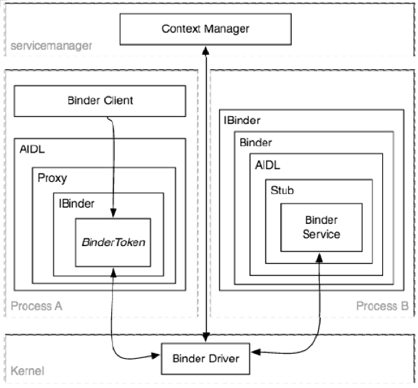
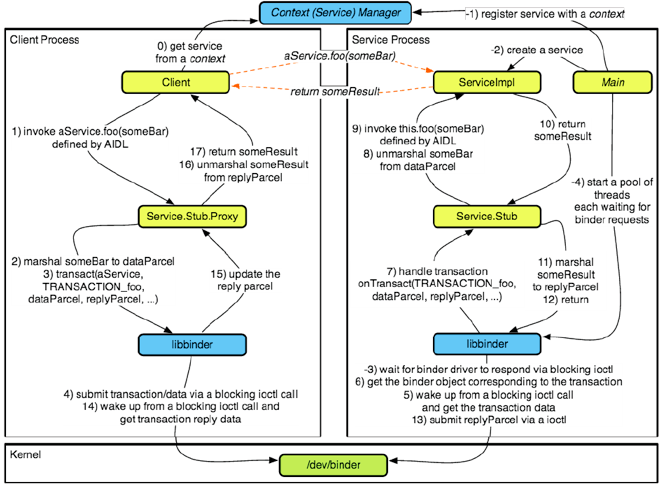

# Binder

## Contents
1. [重要的概念或语法](#重要的概念或语法)
2. [经典的Q&A](#经典的q_a)
3. [最佳实践场景](#最佳实践场景)
4. [简书](#简书)
5. [Github](#github)

# 重要的概念或语法
- Binder(Framework):IPC架构
- IBinder Interface：定义Binder对象需要实现的接口方法
- AIDL：定义服务调用接口的语法
- Binder (Object)：IBinder Interface的实现
- Binder Token：32位的值，用于唯一标识一个Binder对象
- Binder Service：Binder（Object）的真正实现方，即服务端
- Binder Client：调用方
- Binder Transaction：remote Binder（object）调用方法，涉及数据收（reply）发（request）
- Parcel：进程通信的数据结构
- Proxy：客户端代理，AIDL接口实现，序列换和反序列化数据
- Stub：服务端实现代理
- Context Manager (a.k.a. servicemanager)：管理器上下文。特殊的Binder对象，持有Handle0，用于查找其他的service（Binder Object）

## binder各概念关系图

## binder总交互流程图

# 经典的Q_A
## 1.Binder是什么？
Binder是一种进程间通信机制，由4个系统组件组成，分别是Client、Server、ServiceManager和Binder驱动程序，其中Client、Server和ServiceManager运行在用户空间，Binder驱动程序运行在内核空间。Binder就是将这4个组件粘接到一起的粘结剂。其中核心组建是Binder驱动程序，ServiceManager提供辅助管理的功能，Client和Server正是在Binder驱动和ServiceManager提供的基础上，进行Client－Server之间的通信。ServiceManager和Binder驱动已经在Android平台实现好了，开发者只需按照规范实现自己的Client和Server组件即可。
## 2.Binder中的Server、驱动、Client都做了什么事儿？
###(1).服务端Server
一个Binder服务端实际上就是一个Binder类的对象，这个对象一旦创建，内部就启动一个隐藏线程，这个线程接下来就会接收Binder驱动发送的消息，收到消息后，会执行到Binder对象的onTransact()方法，并按照这个方法的参数之行不同的服务代码。因此，要实现一个Binder服务，就必须重载这个onTransact()方法。重载onTransact()方法的主要内容是把onTransact()方法的参数转换为服务方法的参数，而onTransact()的参数的来源是客户端调用transact)()方法时输入的，因此，如果transact()有固定格式的输入，那么onTransact()就有固定格式的输出。
###(2).驱动Driver
任意一个服务端Binder对象被创建时，同时会在Binder驱动中创建一个mRemote对象，该对象的类型也是Binder类。客户端要访问远程服务时，都是通过mRemote对象。
###(3).客户端Client
客户端想要访问远程服务，必须获取远程服务在Binder对象中对应的mRemote引用(TODO如何获取？通过Service：bindService、onServiceConnected)，然后调用mRemote的transact()方法，而在Binder驱动中，mRemote对象也重载了transact()方法，重载的内容主要包括以下几项：
- 以线程间通信的模式，向服务端发送客户端传递过来的参数
- 挂起当前线程，当前线程正是客户端线程，并等待服务端线程执行完指定服务方法后通知（nofity）
- 接收服务端线程的通知，然后继续执行客户端线程，并返回客户端代码区

# 最佳实践场景
# 简书
# Github
